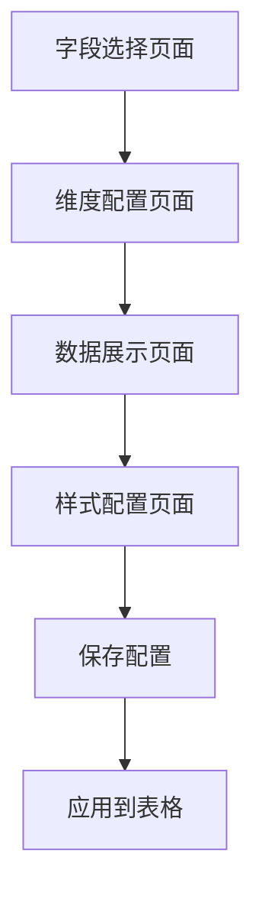

## 1. 产品概述
飞书多维表格前端插件是一个用于增强飞书表格数据展示和分析能力的工具。用户可以通过拖拽调整字段维度顺序，实现多级嵌套的数据展示，支持自定义样式配置，让数据展示更加直观和灵活。

该插件主要解决复杂数据的多维度展示问题，适用于需要对数据进行分层分析的业务场景，如销售数据分析、项目进度跟踪等。

## 2. 核心功能

### 2.1 用户角色
| 角色 | 注册方式 | 核心权限 |
|------|----------|----------|
| 普通用户 | 飞书账号登录 | 查看和配置表格展示 |
| 管理员 | 飞书管理员权限 | 管理插件配置和权限 |

### 2.2 功能模块
飞书多维表格前端插件包含以下核心页面：
1. **字段选择页面**：展示所有可用字段，支持用户选择需要的字段
2. **维度配置页面**：支持拖拽调整字段维度顺序，设置层级关系
3. **数据展示页面**：按照指定维度层级展示数据，支持多级嵌套
4. **样式配置页面**：自定义展示样式，包括颜色、字体等

### 2.3 页面详情
| 页面名称 | 模块名称 | 功能描述 |
|----------|----------|----------|
| 字段选择页面 | 字段列表 | 展示表格所有字段，支持搜索和筛选功能 |
| 字段选择页面 | 字段选择器 | 用户勾选需要的字段，支持全选/取消全选 |
| 字段选择页面 | 已选字段预览 | 实时显示已选择的字段列表 |
| 维度配置页面 | 拖拽排序区 | 支持拖拽调整字段的维度顺序 |
| 维度配置页面 | 层级设置 | 设置字段的层级关系（父级-子级） |
| 维度配置页面 | 预览区 | 实时预览维度配置效果 |
| 数据展示页面 | 多级嵌套展示 | 按照国家>地区>负责人>项目等层级展示数据 |
| 数据展示页面 | 展开/折叠 | 支持展开和折叠各级数据 |
| 数据展示页面 | 数据筛选 | 支持按条件筛选展示数据 |
| 样式配置页面 | 颜色配置 | 自定义各级标题和数据的背景色、文字颜色 |
| 样式配置页面 | 字体设置 | 设置字体大小、粗细等样式 |
| 样式配置页面 | 布局设置 | 调整间距、边框等布局参数 |

## 3. 核心流程

### 用户操作流程：
1. 用户进入插件，首先看到字段选择页面
2. 选择需要展示的字段后，进入维度配置页面
3. 通过拖拽调整字段维度顺序，设置层级关系
4. 在数据展示页面查看多级嵌套的数据展示效果
5. 在样式配置页面自定义展示样式
6. 保存配置并应用到飞书表格

## 4. 用户界面设计

### 4.1 设计风格
- **主色调**：飞书品牌蓝 (#3370ff) 作为主色调，白色作为背景色
- **辅助色**：灰色系用于边框和分割线，绿色用于成功状态，红色用于警告
- **按钮样式**：圆角矩形按钮，3D悬浮效果，hover状态有明显颜色变化
- **字体**：使用系统默认字体，标题16px加粗，正文14px常规
- **布局风格**：卡片式布局，左右分栏设计，左侧为配置区，右侧为预览区
- **图标风格**：使用简洁的线性图标，符合飞书设计规范

### 4.2 页面设计概览
| 页面名称 | 模块名称 | UI元素 |
|----------|----------|----------|
| 字段选择页面 | 字段列表 | 左侧显示所有字段的复选框列表，支持搜索框，每个字段显示名称和类型图标 |
| 字段选择页面 | 已选预览 | 右侧显示已选字段的标签云，支持删除操作 |
| 维度配置页面 | 拖拽区 | 中间区域显示可拖拽的字段卡片，支持上下拖拽排序，显示层级连接线 |
| 维度配置页面 | 配置面板 | 右侧显示层级关系设置，支持设置父子关系 |
| 数据展示页面 | 树形表格 | 主区域显示树形结构的数据表格，支持展开折叠图标，不同层级有不同缩进 |
| 数据展示页面 | 工具栏 | 顶部显示筛选条件、导出按钮等操作控件 |
| 样式配置页面 | 样式面板 | 左侧显示各类样式配置选项，使用分组卡片布局 |
| 样式配置页面 | 实时预览 | 右侧实时显示样式应用效果 |

### 4.3 响应式设计
- 采用桌面端优先设计，适配1920x1080及以上分辨率
- 支持响应式布局，在1366x768分辨率下仍能正常使用
- 移动端采用自适应布局，主要功能在平板端可用
- 触摸交互优化，支持拖拽操作的触摸手势