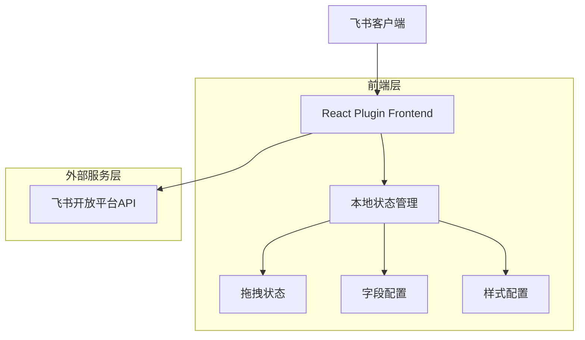
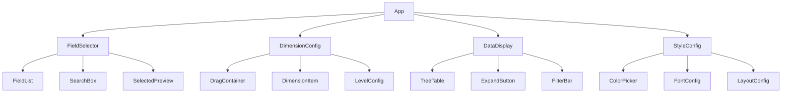

## 1. 架构设计



## 2. 技术描述

- **前端**: React@18 + TypeScript@5 + Vite@5 + Tailwind CSS@3
- **拖拽库**: react-beautiful-dnd@13 或 @dnd-kit/core@6
- **状态管理**: React Context + useReducer
- **UI组件库**: Headless UI + 自定义组件
- **构建工具**: Vite@5
- **代码规范**: ESLint + Prettier
- **类型检查**: TypeScript严格模式

## 3. 路由定义

| 路由 | 用途 |
|------|------|
| / | 字段选择页面，展示所有可用字段 |
| /dimension | 维度配置页面，支持拖拽调整字段顺序 |
| /display | 数据展示页面，按层级展示数据 |
| /style | 样式配置页面，自定义展示样式 |
| /preview | 预览页面，显示最终效果 |

## 4. 核心组件设计

### 4.1 主要组件结构
```typescript
// 字段类型定义
interface Field {
  id: string;
  name: string;
  type: 'text' | 'number' | 'date' | 'select';
  required?: boolean;
}

// 维度配置类型
interface Dimension {
  fieldId: string;
  level: number;
  parentId?: string;
}

// 组件Props定义
interface FieldSelectorProps {
  availableFields: Field[];
  selectedFields: string[];
  onFieldToggle: (fieldId: string) => void;
}

interface DimensionConfigProps {
  fields: Field[];
  dimensions: Dimension[];
  onDimensionChange: (dimensions: Dimension[]) => void;
}

interface DataDisplayProps {
  data: any[];
  dimensions: Dimension[];
  styles: StyleConfig;
}

interface StyleConfig {
  colors: {
    primary: string;
    secondary: string;
    background: string;
  };
  fonts: {
    titleSize: number;
    contentSize: number;
  };
  spacing: {
    padding: number;
    margin: number;
  };
}
```

### 4.2 API接口定义

#### 获取表格字段
```
GET /api/table/fields
```

响应：
```json
{
  "fields": [
    {
      "id": "field_1",
      "name": "国家",
      "type": "text"
    },
    {
      "id": "field_2", 
      "name": "地区",
      "type": "text"
    }
  ]
}
```

#### 获取表格数据
```
GET /api/table/data
```

查询参数：
| 参数名 | 参数类型 | 是否必需 | 描述 |
|--------|----------|----------|------|
| fields | string[] | true | 需要获取的字段ID列表 |
| filter | object | false | 筛选条件 |

响应：
```json
{
  "data": [
    {
      "field_1": "中国",
      "field_2": "华东",
      "field_3": "张三",
      "field_4": "项目A"
    }
  ],
  "total": 100
}
```

## 5. 组件架构设计



## 6. 状态管理设计

### 6.1 全局状态结构
```typescript
interface AppState {
  // 字段相关
  availableFields: Field[];
  selectedFields: string[];
  
  // 维度配置
  dimensions: Dimension[];
  
  // 样式配置
  styles: StyleConfig;
  
  // UI状态
  currentStep: 'field' | 'dimension' | 'display' | 'style';
  loading: boolean;
  error: string | null;
}

// Action类型
type AppAction = 
  | { type: 'SET_FIELDS'; payload: Field[] }
  | { type: 'TOGGLE_FIELD'; payload: string }
  | { type: 'SET_DIMENSIONS'; payload: Dimension[] }
  | { type: 'UPDATE_STYLES'; payload: Partial<StyleConfig> }
  | { type: 'SET_STEP'; payload: AppState['currentStep'] }
  | { type: 'SET_LOADING'; payload: boolean }
  | { type: 'SET_ERROR'; payload: string | null };
```

### 6.2 Context提供者
```typescript
const AppContext = React.createContext<{
  state: AppState;
  dispatch: React.Dispatch<AppAction>;
} | null>(null);

const AppProvider: React.FC<{ children: React.ReactNode }> = ({ children }) => {
  const [state, dispatch] = useReducer(appReducer, initialState);
  
  return (
    <AppContext.Provider value={{ state, dispatch }}>
      {children}
    </AppContext.Provider>
  );
};
```

## 7. 拖拽功能实现

### 7.1 使用react-beautiful-dnd
```typescript
import { DragDropContext, Droppable, Draggable } from 'react-beautiful-dnd';

const DimensionConfig: React.FC = () => {
  const handleDragEnd = (result: DropResult) => {
    if (!result.destination) return;
    
    const items = Array.from(dimensions);
    const [reorderedItem] = items.splice(result.source.index, 1);
    items.splice(result.destination.index, 0, reorderedItem);
    
    dispatch({ type: 'SET_DIMENSIONS', payload: items });
  };
  
  return (
    <DragDropContext onDragEnd={handleDragEnd}>
      <Droppable droppableId="dimensions">
        {(provided) => (
          <div {...provided.droppableProps} ref={provided.innerRef}>
            {dimensions.map((dimension, index) => (
              <Draggable key={dimension.fieldId} draggableId={dimension.fieldId} index={index}>
                {(provided) => (
                  <div
                    ref={provided.innerRef}
                    {...provided.draggableProps}
                    {...provided.dragHandleProps}
                  >
                    <DimensionItem dimension={dimension} />
                  </div>
                )}
              </Draggable>
            ))}
            {provided.placeholder}
          </div>
        )}
      </Droppable>
    </DragDropContext>
  );
};
```

## 8. 样式配置系统

### 8.1 Tailwind CSS配置
```javascript
// tailwind.config.js
module.exports = {
  content: ['./src/**/*.{js,jsx,ts,tsx}'],
  theme: {
    extend: {
      colors: {
        primary: '#3370ff',
        secondary: '#f5f5f5',
        accent: '#00d4ff',
      },
      spacing: {
        '18': '4.5rem',
        '88': '22rem',
      },
    },
  },
  plugins: [],
};
```

### 8.2 动态样式生成
```typescript
const generateStyles = (config: StyleConfig): string => {
  return `
    .custom-primary { background-color: ${config.colors.primary}; }
    .custom-secondary { background-color: ${config.colors.secondary}; }
    .custom-title { font-size: ${config.fonts.titleSize}px; }
    .custom-content { font-size: ${config.fonts.contentSize}px; }
    .custom-spacing { padding: ${config.spacing.padding}px; }
  `;
};
```

## 9. 性能优化

### 9.1 虚拟滚动
对于大量数据展示，使用虚拟滚动优化性能：
```typescript
import { FixedSizeTree } from 'react-vtree';

const VirtualizedTree: React.FC<{ data: any[] }> = ({ data }) => {
  return (
    <FixedSizeTree
      height={600}
      itemSize={50}
      treeWalker={treeWalker}
    >
      {Node}
    </FixedSizeTree>
  );
};
```

### 9.2 组件懒加载
```typescript
const FieldSelector = lazy(() => import('./components/FieldSelector'));
const DimensionConfig = lazy(() => import('./components/DimensionConfig'));
```

## 10. 错误处理

### 10.1 错误边界
```typescript
class ErrorBoundary extends React.Component<
  { children: React.ReactNode },
  { hasError: boolean }
> {
  state = { hasError: false };
  
  static getDerivedStateFromError(error: Error) {
    return { hasError: true };
  }
  
  componentDidCatch(error: Error, errorInfo: ErrorInfo) {
    console.error('Plugin error:', error, errorInfo);
  }
  
  render() {
    if (this.state.hasError) {
      return <ErrorFallback />;
    }
    
    return this.props.children;
  }
}
```